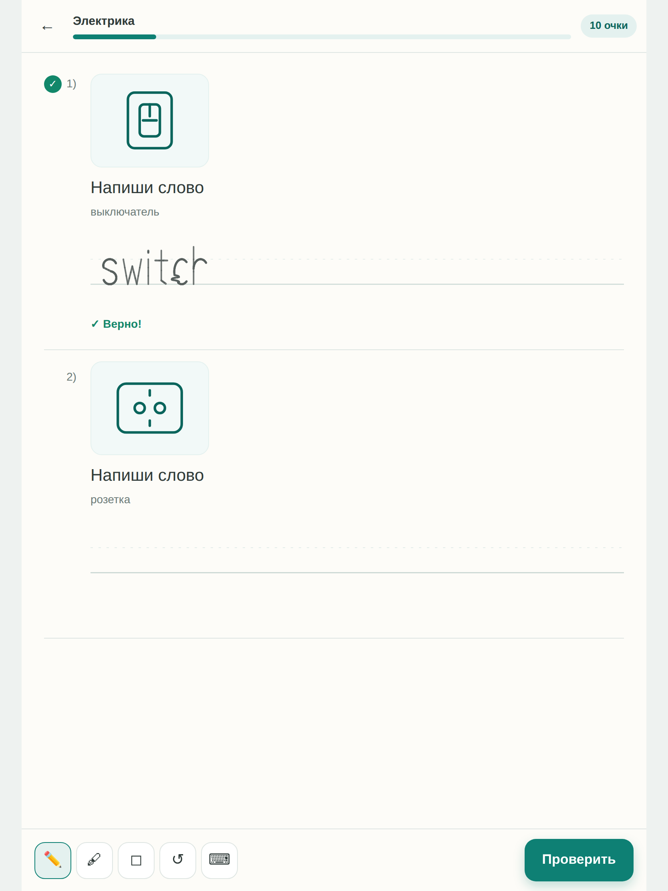

# Grammar Ink

Тренажёр английской грамматики, где ответ **пишут от руки** — стилусом или пальцем, —
а приложение само его читает и проверяет. Кнопку жать не нужно: проверка запускается
через секунду после того, как перо остановилось, и рядом со строкой появляется галочка.

**Открыть:** https://tadhayrapetian.github.io/Gramm-r-/ — на планшете добавь на экран
«Домой», и приложение запустится как обычное, без адресной строки.

Распознавание почерка работает **на устройстве**: ни одного сетевого запроса, ни одной
внешней библиотеки. Приложение — обычная статическая страница, ставится на планшет как
PWA и полностью работает офлайн.



## Запуск локально

```bash
npm start            # http://localhost:8080 (python3 -m http.server)
npm test             # прогон точности распознавания
```

Никакой сборки нет: это ES-модули, открываемые браузером напрямую. Для публикации
достаточно выложить папку на любой статический хостинг (GitHub Pages, Netlify).
Локально нужен именно http-сервер, а не `file://` — иначе браузер не подключит модули.

## Что внутри

**9 уроков, 53 задания:** to be, Present Simple, артикли, множественное число,
Present Continuous, Past Simple, предлоги in/on/at, сравнительная степень и словарный
блок «Электрика» с картинками (switch, socket, plug, cable, extension lead, fuse box).

Четыре типа заданий: написать слово по картинке, вписать пропущенное слово в
предложение, выбрать вариант, собрать предложение из слов. Первые два проверяются по
почерку, остальные — нажатием.

Интерфейс переключается между русским и английским; у каждого задания есть перевод
предложения и короткое напоминание правила.

## Как устроена проверка

Каждый шаг лежит в отдельном модуле `src/ink/`, и его можно читать по порядку:

| Модуль | Что делает |
| --- | --- |
| `surface.js` | линованная строка: перо/карандаш/ластик, нажим, отсечение ладони |
| `geometry.js` | ресемплинг штрихов, оценка и выпрямление наклона |
| `alphabet.js` | 61 эталонное начертание букв (строчные, заглавные, варианты) |
| `recognizer.js` | сопоставление облаков точек ($P) — одна буква |
| `segment.js` | разрезание чернил на буквы и слова |
| `decode.js` | сборка букв в слово по словарю и вынесение вердикта |

Две вещи отличают это от обычного распознавателя жестов:

**Строка — часть данных.** Приложение само рисует линию письма, поэтому знает, где
базовая линия и какова высота строчной буквы. Чернила переводятся в эту систему
координат, и вертикаль становится признаком: `l` высокая, `o` нет, `p` свисает вниз.

**Чтение ограничено словарём.** Побуквенное чтение путает `cl` с `d`, а `rn` с `m`.
Поэтому слово целиком сверяется со словарём: ответы задания, типичные ошибки к нему
(`goed`, `watchs`, `childs`) и общая лексика. Побеждает самое дешёвое слово — в том
числе неправильное, если написано именно оно. Ошибки специально лежат в словаре, чтобы
приложение читало «goed» как «goed», а не подтягивало чернила к правильному ответу.

Вердиктов три, и третий важен: **верно**, **неверно** и **не разобрал**. Если чернила
читаются почти одинаково и как правильный ответ, и как другой — приложение честно
просит переписать, вместо того чтобы засчитать ошибку. Досрочная проверка (пока человек
ещё пишет) никогда не фиксирует ошибку: результат показывается, но остаётся отменяемым,
пока пишут дальше.

### Настройка почерка

Экран «Настроить почерк» просит написать каждую букву один раз. Свои начертания
приложение ставит выше встроенных. Это необязательно, но заметно помогает: встроенные
образцы — это чьё-то представление о том, как выглядит `k` или `t`.

Второй способ — прямо в уроке. Если приложение прочитало не то или не разобрало,
рядом с ответом есть кнопка **«Я написал правильно»**: она засчитывает ответ и заодно
сохраняет написанные буквы как твои эталоны. Учится только тогда, когда разрезание
чернил совпало с ответом буква в букву — иначе распознаватель выучил бы неверную форму.

Если почерк всё равно не читается, в доке есть переключатель на клавиатуру.

## Точность

`npm test` синтезирует рукописный ввод: эталонные буквы прогоняются через наклон,
масштаб, пропорции, дрожание и волну, с единым «почерком» на слово. Текущие цифры
(`--samples 24`):

| Проверка | Результат |
| --- | --- |
| Буквы, все варианты известны | 97.5% top-1 |
| Буквы, сильные искажения | 90.9% top-1 |
| Буквы, невиданное начертание | 39.9% top-1 |
| Слова целиком | 76.7% зачтено, 10.8% «не разобрал», 12.5% прочитано неверно |
| Неправильные ответы | 83.3% пойманы, 3.3% зачтены ошибочно |

Честно о том, что эти числа значат: **это не измерение на живых людях.** Синтетика
проверяет устойчивость к деформации, а не читаемость реального почерка. Строка
«невиданное начертание» — самая показательная: если человек пишет букву непривычной
формой, встроенный образец её почти не узнаёт, и именно поэтому в приложении есть
настройка почерка и ввод с клавиатуры.

Слабое место — не буквы, а разрезание слова на буквы: плотно написанные и слипшиеся
буквы дают большую часть ошибок. Поэтому чернила режутся тремя способами, и выбирается
тот вариант, который читается увереннее.

## Ограничения

- **Слитное письмо не поддерживается** — нужны печатные буквы с промежутками.
  Приложение это распознаёт и подсказывает, а не молча ошибается.
- Одна строка на ответ; многострочные ответы не предусмотрены.
- Прогресс хранится в `localStorage` этого браузера — без аккаунтов и синхронизации.
- Проверка сравнивает ответ с заранее заданным списком: это тренажёр по готовым
  заданиям, а не оценка свободного текста.

## Структура

```
index.html            оболочка страницы
styles/app.css        оформление
src/main.js           роутер и загрузка почерка
src/ink/              чернила и распознавание
src/data/             уроки, словарь, картинки
src/ui/               экраны: главный, урок, настройка почерка
tools/eval.mjs        стенд точности
sw.js                 офлайн-кеш
```

---

**English summary.** Grammar Ink is an English grammar trainer where answers are
handwritten and checked on the device — no network, no dependencies, no build step.
A $P point-cloud matcher reads letters against 61 built-in letterforms, using the ruled
line to make vertical position meaningful; words are then decoded against a small
lexicon that deliberately includes the mistakes learners make, so a wrong answer reads
as the wrong word instead of snapping to the right one. When a reading is too close to
call, the app says so rather than marking the learner wrong. Run `npm start` to use it
and `npm test` for the accuracy harness; see the honest caveats about those numbers in
the section above.
